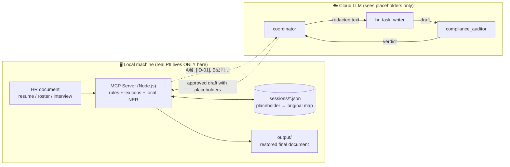

# PII Firewall Agent

**Cloud-grade AI reasoning over HR documents — where the cloud never sees a single piece of personal data.**

Built for the Kaggle × Google [AI Agents: Intensive Vibe Coding Capstone Project](https://www.kaggle.com/competitions/vibecoding-agents-capstone-project) — Track: **Agents for Business**.

## The Problem

HR teams sit on the most sensitive data in any company: national ID numbers, salaries, home addresses, medical notes, exit-interview confessions. They also have the most to gain from LLM assistants — summarizing résumés, drafting recommendation emails, turning interview notes into reports.

Those two facts collide. Pasting an employee roster into a cloud chatbot is, in most jurisdictions, a personal-data breach waiting to happen. In Taiwan, the Personal Data Protection Act (個人資料保護法) exposes companies to fines and civil liability for exactly this. So HR either bans LLMs (losing the productivity) or quietly leaks PII (accepting the risk).

**PII Firewall Agent removes the trade-off**: the cloud model does all the reasoning and writing, but it only ever sees redacted text. Detection, redaction, and re-identification run entirely on the local machine.

## How It Works



The loop: **de-identify → cloud reasoning → re-identify.**

1. The user gives the coordinator a **file path** (never file content).
2. The local MCP server reads the file, detects PII through four offline layers, and returns text where every value is a placeholder (`A君`, `[ID-01]`, `B公司`).
3. The writer agent produces the requested document from the redacted text.
4. The auditor agent re-scans the draft with the local detector to prove nothing leaked, and can bounce it back for rewrite.
5. On request, the local server restores placeholders to real values and writes the final document to `output/` — returning only the file path, so restored content never transits the cloud either.

## Why This Is Actually Safe (Not Just Politely Asked To Be)

Most "privacy-aware" agent designs rely on prompt instructions: *please don't reveal personal data*. This project enforces the boundary **architecturally**:

| Guarantee | Mechanism |
|---|---|
| Original text never enters LLM context | Files are read inside the MCP server process; the agent only ever holds a path string |
| Tool responses cannot leak PII | Every response passes through `sanitizeForCloud()`, a whitelist projection — original values are not part of any response schema (`mcp-server/src/tools.js`) |
| Restored documents never transit the cloud | `restore_and_export` writes locally and returns only a path |
| Agents get least privilege | ADK `tool_filter`: the writer has **no tools**, the auditor can only scan, the coordinator can't scan |
| Pasted content is refused | The coordinator rejects raw document text in chat and demands a file path |
| The claim is executable | The integration test spawns the real server and asserts **no tool response contains any original PII string from the samples** (`test/mcp-integration.test.js`) |
| It's observable | Every tool call logs its cloud-bound payload to stderr — you can watch exactly what the model is allowed to see |

The mapping table lives in `.sessions/*.json` (mode `0600`, gitignored). That file is the only place placeholders and originals coexist.

## Local Detection Pipeline (Taiwan-tuned)

Four offline layers, merged and de-duplicated — no external API is ever consulted:

1. **Rule engine** — regex + checksums for Taiwan national IDs (incl. new-style ARC numbers), Unified Business Numbers (**with checksum validation**, weights `1,2,1,2,1,2,4,1`), mobile/landline phones, ROC-era and Western dates, street addresses, emails.
2. **Field-label keywords** — `姓名：王小明` / `月薪：48,000 元` style label-value lines, including pipe-separated roster rows.
3. **Document patterns** — label-less values: a bare name atop a résumé, `…股份有限公司`, school names.
4. **Curated lexicons** — 41k+ entries from Taiwanese open data: government agencies, procurement vendors, school registry.
5. **Local NER (optional)** — CKIP `bert-base-chinese-ner` (ONNX, ~100MB) running in-process via `@huggingface/transformers`; catches in-sentence names the rules can't. Degrades gracefully when unavailable (`PII_FIREWALL_NER=off`).

Placeholders keep **referential integrity**: the same person is `A君` everywhere in the document, so the LLM can still reason about who did what. Documents with >10 people switch to numeric labels (`人員-001`).

## Repository Layout

```
mcp-server/          Node.js MCP server (the firewall) — stdio transport
  src/lib/text-pii.js    detection engine (ported from a production browser extension)
  src/tools.js           4 MCP tools + sanitizeForCloud() whitelist exit
  src/session-store.js   local-only mapping persistence
  test/                  13 tests incl. the no-leak integration test
agent/               Python ADK multi-agent app
  pii_firewall/agent.py  coordinator + writer + auditor, least-privilege wiring
samples/             Fully synthetic Taiwanese HR documents (AI-generated)
output/              Restored documents land here (gitignored)
```

## Setup

Prerequisites: Node.js ≥ 18, Python 3.12 (via [uv](https://docs.astral.sh/uv/)), an API key for Anthropic Claude **or** Google Gemini.

```bash
# 1. MCP server
cd mcp-server
npm install
npm test                    # 13/13, fully offline
npm run smoke               # watch a résumé get redacted and round-tripped
npm run prefetch-model      # optional: pre-download the NER model (~100MB)

# 2. Agent
cd ../agent
uv venv -p 3.12 .venv
uv pip install -p .venv -r requirements.txt mcp
cp .env.example .env        # fill in YOUR key — never committed

# 3. Run the dev UI
./run_web.sh                # opens adk web on http://localhost:8000
```

Then try, in the ADK chat:

> 請處理 ../samples/resume_01.txt，幫我寫一封推薦候選人給用人主管的 Email

…and when the approved draft comes back:

> 請還原並輸出成 email_final.txt

Watch the trace panel: you'll see the coordinator delegate to the writer, the auditor scan the draft, and the restore step return only a local file path. Open `.sessions/<id>.json` in a terminal to see the only place real data ever lived.

The model is provider-agnostic via LiteLLM — set `AGENT_MODEL` in `.env` (`anthropic/claude-opus-4-8` by default, or `gemini-2.5-flash`).

## Testing

```bash
cd mcp-server && npm test
```

- Checksum and regex unit tests (valid/invalid Taiwan tax IDs, IDs, phones, addresses)
- **Round-trip invariant**: `restore(redact(text)) === text` for every sample
- Whitespace-tolerant restore (LLMs like to insert spaces into `A君`)
- **The security claim as a test**: an MCP client spawns the real server, exercises all four tools, and asserts no response contains any planted PII string

## Course Concepts Demonstrated

| Concept | Where |
|---|---|
| Multi-agent system (ADK) | `agent/pii_firewall/agent.py` — coordinator + 2 sub-agents with delegation |
| MCP server | `mcp-server/` — 4 tools over stdio, built with `@modelcontextprotocol/sdk` |
| Security features | Whitelist exit point, least-privilege tool filters, local-only mapping, refuse-pasted-content policy, leak-proof integration test |
| Agent development workflow | Built with Claude Code + Antigravity (see video) |

## Data & Privacy Notes

- All sample documents are **AI-generated fiction** — every name, ID, phone number and salary is synthetic (IDs/tax-IDs are format-valid but fabricated).
- No API keys in the repo; `run_web.sh` loads yours at launch.
- `.sessions/`, `output/`, and the model cache are gitignored.
